# DSI-TB Backend API Documentation

## Table of Contents

**Part I: System Foundation**
1. [System Overview](#system-overview)
2. [Architecture](#architecture)
3. [Authentication & Authorization](#authentication--authorization)

**Part II: User Roles & API Endpoints**
4. [User Roles & API Endpoints](#user-roles--api-endpoints)
   - [Super Admin Role](#1-super-admin-super_admin)
   - [Facility Admin Role](#2-facility-admin-facility_admin)
   - [Doctor Role](#3-doctor-doctor)
   - [Nurse Role](#4-nurse-nurse)
   - [Lab Technician Role](#5-lab-technician-lab_technician)
   - [Radiographer Role](#6-radiographer-radiographer)
   - [Radiologist Role](#7-radiologist-radiologist)

**Part III: Clinical Workflows**
5. [Clinical Workflows](#clinical-workflows)
   - [Laboratory Test Workflow](#1-laboratory-test-workflow)
   - [Medical Imaging Workflow](#2-medical-imaging-workflow)

**Part IV: System Components**
6. [Error Handling](#error-handling)
7. [Integration Components](#integration-components)

---

## System Overview

This document provides a comprehensive overview of the DSI-TB backend, including database structure, authentication, API endpoints, request/response examples, and module-specific details. 

### Key Features

| Feature Category | Capabilities |
|------------------|-------------|
| **Authentication & Security** | OAuth2/JWT with Keycloak, role-based access control (RBAC), rate limiting |
| **Clinical Workflows** | Laboratory test management, imaging test workflows, prescription management |
| **AI/ML Integration** | Sputum conversion prediction models, automated risk assessment, clinical decision support |
| **Patient Management** | Comprehensive demographics, medical history, visit tracking |
| **Multi-tenancy** | Facility-based data isolation, hierarchical organization management |
| **Logging** | Complete activity logging, security event tracking |
| **Integration** | Orthanc DICOM integration, notification systems, RESTful API design |

### Technology Stack

| Component | Technology | Purpose |
|-----------|------------|---------|
| **Application Framework** | FastAPI 0.104+ | High-performance async API framework |
| **Runtime** | Python 3.11+ | Modern Python with enhanced performance |
| **Database** | PostgreSQL 13+ | ACID-compliant relational database |
| **ORM** | SQLModel 0.0.8+ | Type-safe database modeling |
| **Authentication** | Keycloak 21+ | Enterprise identity and access management |
| **Database Migrations** | Alembic 1.12+ | Schema version control |
| **File Storage** | Local filesystem | Medical image and document storage |
| **API Documentation** | OpenAPI 3.0 | Interactive API documentation |
| **Logging** | Python logging | Structured application and security logging |
| **Medical Imaging** | Orthanc DICOM | Medical image management and PACS integration |

---

## Architecture

### System Architecture Overview

The DSI-TB backend follows a layered, microservice-ready architecture with clear separation of concerns and enterprise-grade design patterns.

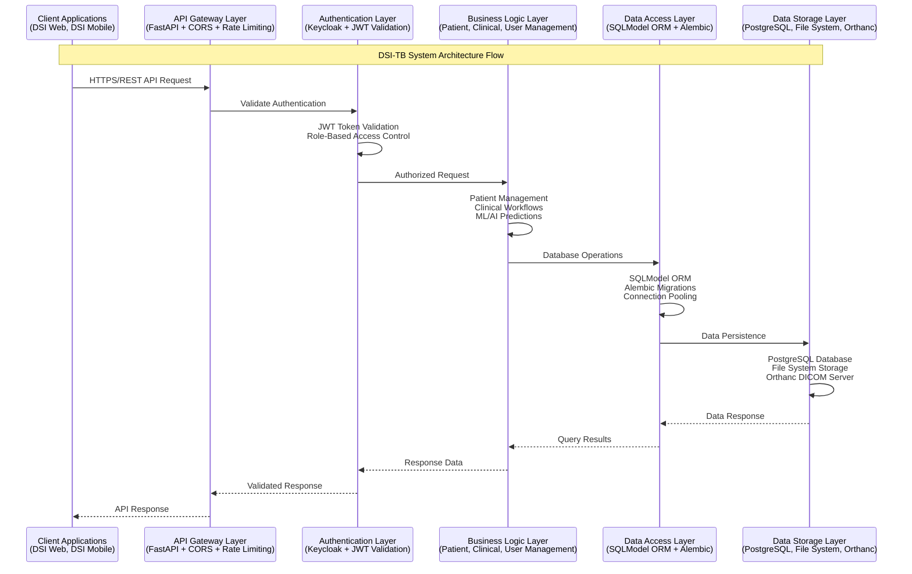
```mermaid
sequenceDiagram
    participant Client as Client Applications<br/>(DSI Web, DSI Mobile)
    participant Gateway as API Gateway Layer<br/>(FastAPI + CORS + Rate Limiting)
    participant Auth as Authentication Layer<br/>(Keycloak + JWT Validation)
    participant Business as Business Logic Layer<br/>(Patient, Clinical, User Management)
    participant Data as Data Access Layer<br/>(SQLModel ORM + Alembic)
    participant Storage as Data Storage Layer<br/>(PostgreSQL, File System, Orthanc)

    Note over Client,Storage: DSI-TB System Architecture Flow
    
    Client->>Gateway: HTTPS/REST API Request
    Gateway->>Auth: Validate Authentication
    Auth->>Auth: JWT Token Validation<br/>Role-Based Access Control
    Auth->>Business: Authorized Request
    Business->>Business: Patient Management<br/>Clinical Workflows<br/>ML/AI Predictions
    Business->>Data: Database Operations
    Data->>Data: SQLModel ORM<br/>Alembic Migrations<br/>Connection Pooling
    Data->>Storage: Data Persistence
    Storage->>Storage: PostgreSQL Database<br/>File System Storage<br/>Orthanc DICOM Server
    Storage-->>Data: Data Response
    Data-->>Business: Query Results
    Business-->>Auth: Response Data
    Auth-->>Gateway: Validated Response
    Gateway-->>Client: API Response
```

### Security Architecture

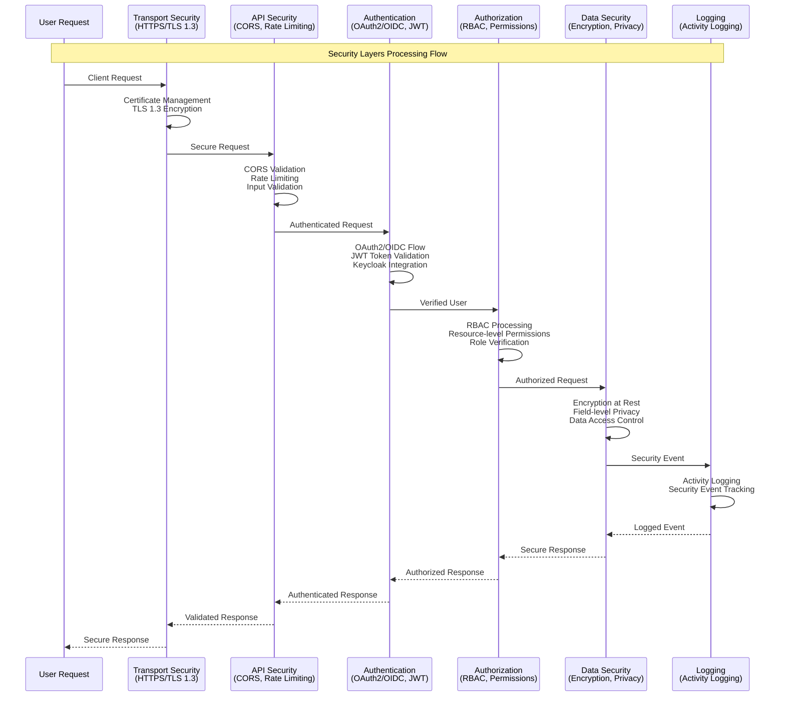
```mermaid
sequenceDiagram
    participant User as User Request
    participant Transport as Transport Security<br/>(HTTPS/TLS 1.3)
    participant API as API Security<br/>(CORS, Rate Limiting)
    participant Auth as Authentication<br/>(OAuth2/OIDC, JWT)
    participant Authz as Authorization<br/>(RBAC, Permissions)
    participant Data as Data Security<br/>(Encryption, Privacy)
    participant Audit as Logging<br/>(Activity Logging)

    Note over User,Audit: Security Layers Processing Flow
    
    User->>Transport: Client Request
    Transport->>Transport: Certificate Management<br/>TLS 1.3 Encryption
    Transport->>API: Secure Request
    API->>API: CORS Validation<br/>Rate Limiting<br/>Input Validation
    API->>Auth: Authenticated Request
    Auth->>Auth: OAuth2/OIDC Flow<br/>JWT Token Validation<br/>Keycloak Integration
    Auth->>Authz: Verified User
    Authz->>Authz: RBAC Processing<br/>Resource-level Permissions<br/>Role Verification
    Authz->>Data: Authorized Request
    Data->>Data: Encryption at Rest<br/>Field-level Privacy<br/>Data Access Control
    Data->>Audit: Security Event
    Audit->>Audit: Activity Logging<br/>Security Event Tracking
    Audit-->>Data: Logged Event
    Data-->>Authz: Secure Response
    Authz-->>Auth: Authorized Response
    Auth-->>API: Authenticated Response
    API-->>Transport: Validated Response
    Transport-->>User: Secure Response
```

---

---


## Authentication & Authorization

### Authentication Architecture

The DSI-TB system implements enterprise-grade authentication using **Keycloak** as the Identity and Access Management (IAM) provider, following OAuth2/OIDC standards with JWT tokens for stateless authentication.

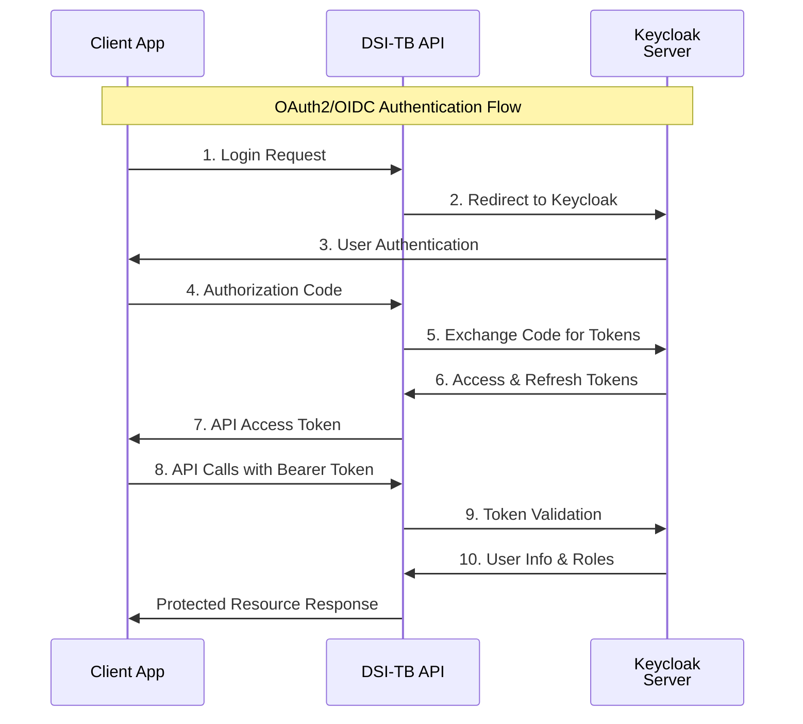
```mermaid
sequenceDiagram
    participant Client as Client App
    participant API as DSI-TB API
    participant Keycloak as Keycloak<br/>Server

    Note over Client,Keycloak: OAuth2/OIDC Authentication Flow
    
    Client->>API: 1. Login Request
    API->>Keycloak: 2. Redirect to Keycloak
    Keycloak->>Client: 3. User Authentication
    Client->>API: 4. Authorization Code
    API->>Keycloak: 5. Exchange Code for Tokens
    Keycloak->>API: 6. Access & Refresh Tokens
    API->>Client: 7. API Access Token
    Client->>API: 8. API Calls with Bearer Token
    API->>Keycloak: 9. Token Validation
    Keycloak->>API: 10. User Info & Roles
    API->>Client: Protected Resource Response
```

### JWT Token Structure

```json
{
  "header": {
    "alg": "RS256",
    "typ": "JWT",
    "kid": "keycloak-key-id"
  },
  "payload": {
    "iss": "https://keycloak.server/realms/DSI-TB",
    "sub": "123e4567-e89b-12d3-a456-426614174000",
    "aud": "dsi-tb-client",
    "exp": 1703923200,
    "iat": 1703919600,
    "realm_access": {
      "roles": ["doctor", "user"]
    },
    "resource_access": {
      "dsi-tb-client": {
        "roles": ["doctor"]
      }
    },
    "email": "doctor@hospital.com",
    "name": "Dr. John Smith",
    "preferred_username": "doctor1",
    "facility_id": "facility-123"
  }
}
```

### Authentication Endpoints

#### `POST /auth/login`

**Purpose**: Authenticate user and obtain access tokens.

**Request Schema**:
```json
{
  "username": "string",    // Required: User email or username
  "password": "string"     // Required: User password (min 8 chars)
}
```

**Response Schema**:
```json
{
  "access_token": "string",     // JWT access token (1 hour expiry)
  "refresh_token": "string",    // Refresh token (24 hours expiry)
  "token_type": "Bearer",       // Token type for Authorization header
  "expires_in": 3600,           // Access token expiry in seconds
  "refresh_expires_in": 86400,  // Refresh token expiry in seconds
  "user_id": "string",          // User's unique identifier
  "roles": ["string"]           // Assigned roles array
}
```

**Authentication Requirements**: None
**Rate Limiting**: 5 requests per minute per IP

#### `POST /auth/refresh`

**Purpose**: Refresh expired access token using refresh token.

**Request Schema**:
```json
{
  "refresh_token": "string"    // Required: Valid refresh token
}
```

**Response Schema**: Same as login response

**Authentication Requirements**: Valid refresh token
**Rate Limiting**: 10 requests per minute per user

#### `GET /auth/userinfo`

**Purpose**: Get current user information and roles.

**Response Schema**:
```json
{
  "user_id": "string",
  "email": "string",
  "full_name": "string",
  "roles": ["string"],
  "facility_id": "integer",
  "designation": "string",
  "is_active": true,
  "last_login": "2024-01-20T10:30:00Z"
}
```

**Authentication Requirements**: Valid Bearer token
**Rate Limiting**: None

#### `POST /auth/forgot-password`

**Purpose**: Initiate password reset workflow.

**Request Schema**:
```json
{
  "email": "string"    // Required: User's email address
}
```

**Response Schema**:
```json
{
  "message": "Password reset instructions sent to email",
  "request_id": "string"
}
```

**Authentication Requirements**: None
**Rate Limiting**: 3 requests per hour per IP

### Security Implementation

#### Token Validation Pipeline

1. **Extract Token**: Parse `Authorization: Bearer <token>` header
2. **Signature Verification**: Validate JWT signature using Keycloak public keys
3. **Claims Validation**: Verify issuer, audience, expiration
4. **User Resolution**: Extract user ID and fetch user details
5. **Role Extraction**: Parse realm and resource-level roles
6. **Permission Check**: Apply role-based access control

#### Security Headers

```python
# Implemented security headers
{
    "X-Content-Type-Options": "nosniff",
    "X-Frame-Options": "DENY",
    "X-XSS-Protection": "1; mode=block",
    "Strict-Transport-Security": "max-age=31536000; includeSubDomains",
    "Content-Security-Policy": "default-src 'self'",
    "Referrer-Policy": "strict-origin-when-cross-origin"
}
```

#### Rate Limiting Configuration

| Endpoint Category | Limit | Window | Scope |
|------------------|-------|--------|-------|
| Authentication | 5 req/min | 60s | IP Address |
| Password Reset | 3 req/hour | 3600s | IP Address |
| API Endpoints | 100 req/min | 60s | User |
| File Upload | 10 req/min | 60s | User |
| ML Predictions | 20 req/hour | 3600s | User |

---

## User Roles & API Endpoints

The DSI-TB system implements Role-Based Access Control (RBAC) with seven distinct user roles. Each role has specific endpoints and exact responsibilities as implemented in the codebase.

### 1. Super Admin (`super_admin`)

**System-wide administrative privileges**

#### Complete Endpoint List

##### Facility Management
- `POST /register-facility/` - Register new facility in the system
- `GET /get_facilities/` - Retrieve list of all facilities  
- `PUT /update-facility/{facility_id}` - Update facility details
- `DELETE /delete-facility/{facility_id}` - Delete facility and all associated users

##### User Administration  
- `POST /create-facility-admin/` - Create facility admin for specific facility
- `PUT /facility-admins/{admin_id}` - Update facility admin details
- `DELETE /facility-admins/{admin_id}` - Delete facility admin
- `GET /facility-admins` - List all facility admins

#### User Workflow: Super Admin

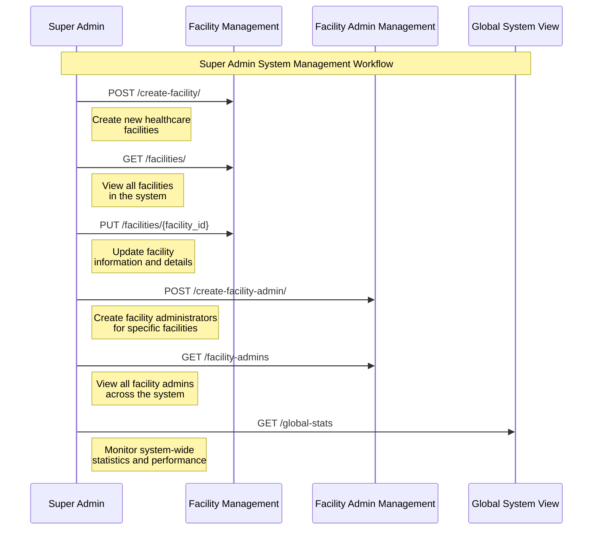
```mermaid
sequenceDiagram
    participant Admin as Super Admin
    participant Facilities as Facility Management
    participant FacilityAdmins as Facility Admin Management
    participant GlobalView as Global System View

    Note over Admin,GlobalView: Super Admin System Management Workflow
    
    Admin->>Facilities: POST /create-facility/
    Note right of Admin: Create new healthcare<br/>facilities
    
    Admin->>Facilities: GET /facilities/
    Note right of Admin: View all facilities<br/>in the system
    
    Admin->>Facilities: PUT /facilities/{facility_id}
    Note right of Admin: Update facility<br/>information and details
    
    Admin->>FacilityAdmins: POST /create-facility-admin/
    Note right of Admin: Create facility administrators<br/>for specific facilities
    
    Admin->>FacilityAdmins: GET /facility-admins
    Note right of Admin: View all facility admins<br/>across the system
    
    Admin->>GlobalView: GET /global-stats
    Note right of Admin: Monitor system-wide<br/>statistics and performance
```

---

### 2. Facility Admin (`facility_admin`)

**Single facility administration and staff management**

#### Complete Endpoint List

##### Staff Creation & Management
- `POST /create-clinician/` - Create clinician for their facility (doctor, nurse, lab_technician, radiologist, radiographer, receptionist)
- `PUT /update-user/{user_id}` - Update user information (same facility only)
- `PUT /doctors/{doctor_id}` - Update doctor information  
- `DELETE /doctors/{doctor_id}` - Delete doctor
- `PUT /lab-technicians/{technician_id}` - Update lab technician information
- `DELETE /lab-technicians/{tech_id}` - Delete lab technician

##### Role Assignment
- `POST /assign-roles/{user_id}` - Assign multiple roles to user
- `DELETE /unassign-role/{user_id}/{role_name}` - Unassign specific role from user

##### Facility Operations
- `GET /doctors` - List all doctors in facility
- `GET /lab-technicians` - List all lab technicians in facility  
- `GET /doctor/{doctor_id}/patients` - Get patients added by specific doctor
- `GET /facility/users` - List all users in facility (with filtering by role, search, sorting)

---

### 3. Doctor (`doctor`)

**Patient care, clinical decisions, test ordering, ML predictions**

#### Complete Endpoint List

##### Patient Management
- `GET /doctor/search-patients` - Search patients by name, phone, or national_id
- `POST /register-new-patient` - Register new patient (auto-assigned to doctor)  
- `GET /patient/{patient_id}` - Get patient details
- `GET /doctor/my-assigned-patients/` - Get patients assigned to doctor
- `GET /doctor/my-added-patients/` - Get patients added/registered by doctor

##### Medical History & Clinical Notes
- `PUT /doctor/add-additional-info/{patient_id}` - Add or update additional patient information

##### Test Ordering
- `POST /doctor/lab-test-orders` - Order laboratory tests for patients
- `POST /doctor/imaging-test-orders` - Order imaging tests for patients  
- `GET /doctor/lab-test-orders` - Get lab test orders made by doctor
- `GET /doctor/lab-test-orders/{lab_test_order_id}` - Get specific lab test order details
- `GET /doctor/imaging-test-orders` - Get imaging test orders made by doctor
- `GET /doctor/imaging-test-orders/{imaging_test_order_id}` - Get specific imaging test order details

##### Prescription Management
- `POST /doctor/prescriptions` - Create a prescription for a patient
- `GET /doctor/prescriptions` - List prescriptions by doctor or patient
- `PUT /doctor/prescriptions/{prescription_id}` - Update a prescription
- `GET /doctor/visit/{visit_id}/prescriptions` - Get all prescriptions for a visit

##### ML Model Predictions
- `POST /predict-mdr-2months-patient/{patient_id}` - Get sputum conversion prediction for patient
- `POST /predict-mdr-2months-patient/{prediction_id}/comments` - Add doctor comments to prediction

##### Visit Management
- `POST /visits/` - Start new patient visit
- `GET /visits/{visit_id}` - Get visit details
- `GET /visits/patient/{patient_id}` - Get patient's visits
- `PUT /visits/{visit_id}/complete` - Complete visit
- `POST /visits/{visit_id}/notes/` - Add note to visit

##### Dashboard & Statistics
- `GET /doctor/my-facility` - Get doctor's facility details
- `GET /doctor/stats/lab-tests` - Get lab test order statistics
- `GET /doctor/stats/imaging-tests` - Get imaging test order statistics
- `GET /doctor/stats/visits-patients` - Get visit and patient statistics  
- `GET /doctor/stats/ml-predictions` - Get ML prediction statistics

##### Staff Directory Access
- `GET /doctor/lab-technicians` - List lab technicians in facility
- `GET /doctor/radiographers` - List radiographers in facility
- `GET /doctors/` - List doctors in facility (accessible by nurses for assignment)

---

### 4. Nurse (`nurse`)

**Patient registration, medical history collection, doctor assignment**

#### Complete Endpoint List

##### Patient Registration
- `POST /nurse/register-new-patient` - Register new patient
- `GET /search-patients` - Search for existing patients by name, phone, or national_id

##### Medical History Management  
- `PUT /nurse/add-medical-history/{patient_id}` - Add or update medical history (symptoms, weight, height, risk group)

##### Patient Assignment
- `PUT /assign-doctor/{patient_id}` - Assign doctor to patient
- `DELETE /unassign-doctor/{patient_id}` - Unassign doctor from patient

##### Patient Access
- `GET /nurse/my-added-patients/` - Get patients added by nurse
- `GET /facility/patients` - Get all patients in facility
- `GET /patient/{patient_id}` - Get patient details

##### Dashboard & Facility
- `GET /nurse/my-facility` - Get nurse's facility details
- `GET /nurse/stats/dashboard` - Get nurse dashboard statistics
- `GET /doctors/` - List doctors in facility (for assignment purposes)

---

### 5. Lab Technician (`lab_technician`)

**Laboratory test processing, specimen analysis, result reporting**

#### Complete Endpoint List

##### Test Queue Management
- `GET /lab/pending-tests` - List pending lab test orders assigned to technician
- `GET /lab/tests` - List all lab test orders in facility (with status and patient filtering)
- `GET /lab/test-orders/{lab_test_order_id}` - Get specific lab test order details

##### Results Processing
- `POST /lab/submit-test-results` - Submit laboratory test results
- `PUT /lab/reports/{lab_test_report_id}` - Update existing lab test report
- `GET /lab/reports/{lab_test_report_id}` - Get specific lab test report details

##### Report Management
- `GET /lab/reports` - List lab reports with filtering (by technician, patient, date range, test name)

##### Dashboard
- `GET /lab/stats` - Get lab technician dashboard statistics

---

### 6. Radiographer (`radiographer`)

**Medical imaging acquisition, image upload, equipment operation**

#### Complete Endpoint List

##### Imaging Orders
- `GET /radiographer/imaging-test-orders` - Get imaging test orders (with status and patient filtering)
- `GET /radiographer/imaging-test-orders/{order_id}` - Get specific imaging test order details

##### Image Acquisition  
- `POST /radiographer/imaging-tests` - Create imaging test record (indicates test performed)
- `POST /radiographer/upload-image` - Upload patient image for imaging test
- `GET /radiographer/imaging-tests/{imaging_test_id}` - Get imaging test details

##### Work History
- `GET /radiographer/imaging-tests` - Get imaging tests performed by radiographer

##### Dashboard
- `GET /radiographer/stats` - Get radiographer dashboard statistics

---

### 7. Radiologist (`radiologist`)

**Medical image interpretation, diagnostic reporting**

#### Complete Endpoint List

##### Analysis Queue
- `GET /radiologist/pending-reports` - List imaging tests awaiting radiology reports
- `GET /radiologist/imaging-test/{imaging_test_id}/images` - Get images for analysis

##### Report Generation
- `POST /radiologist/submit-report` - Submit radiology report for imaging test
- `PUT /radiologist/reports/{report_id}` - Update existing radiology report
- `GET /radiologist/reports/{imaging_test_id}` - Get radiology report by imaging test ID
- `GET /radiologist/reports` - Get radiology reports created by radiologist

##### Dashboard
- `GET /radiologist/stats` - Get radiologist dashboard statistics

---

### 8. Additional Shared Endpoints

#### Authentication (All Roles)
- `POST /login` - User authentication
- `POST /refresh` - Refresh access token
- `GET /userinfo` - Get current user information
- `POST /forgot-password` - Password reset request
- `GET /users/me` - Get current user details
- `POST /change-password/` - Change user password

#### Notifications (All Authenticated Users)
- `GET /notifications` - Get user notifications
- `GET /notifications/unread` - Get unread notifications  
- `PUT /notifications/{notification_id}/read` - Mark notification as read
- `WebSocket /ws/notifications` - Real-time notifications

#### Visit Management (Doctors)
- `POST /visits/` - Start new visit
- `GET /visits/{visit_id}` - Get visit details
- `GET /visits/patient/{patient_id}` - Get patient visits
- `PUT /visits/{visit_id}/complete` - Complete visit
- `POST /visits/{visit_id}/notes/` - Add visit note

| Capability | Endpoints | Description |
|------------|-----------|-------------|
| **Staff Management** | `POST /create-clinician/`, `PUT /update-user/{user_id}` | Hire and manage facility staff |
| **Role Assignment** | `POST /assign-roles/{user_id}`, `DELETE /unassign-role/{user_id}/{role_name}` | Assign and revoke user roles |
| **Facility Operations** | `GET /facility/users`, `GET /doctor/{doctor_id}/patients` | Operational oversight and monitoring |
| **Department Management** | Lab/Imaging staff management endpoints | Manage specialized departments |

#### User Workflow: Facility Admin

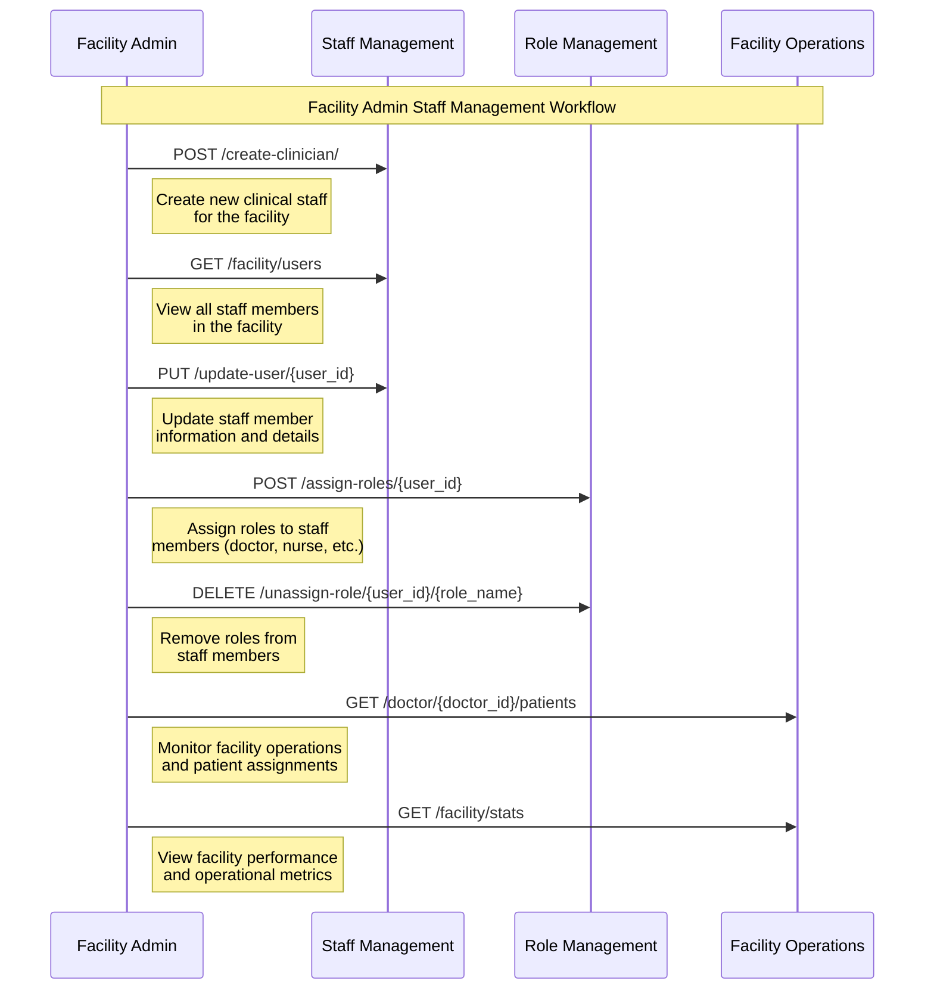
```mermaid
sequenceDiagram
    participant Admin as Facility Admin
    participant Staff as Staff Management
    participant Roles as Role Management
    participant Operations as Facility Operations

    Note over Admin,Operations: Facility Admin Staff Management Workflow
    
    Admin->>Staff: POST /create-clinician/
    Note right of Admin: Create new clinical staff<br/>for the facility
    
    Admin->>Staff: GET /facility/users
    Note right of Admin: View all staff members<br/>in the facility
    
    Admin->>Staff: PUT /update-user/{user_id}
    Note right of Admin: Update staff member<br/>information and details
    
    Admin->>Roles: POST /assign-roles/{user_id}
    Note right of Admin: Assign roles to staff<br/>members (doctor, nurse, etc.)
    
    Admin->>Roles: DELETE /unassign-role/{user_id}/{role_name}
    Note right of Admin: Remove roles from<br/>staff members
    
    Admin->>Operations: GET /doctor/{doctor_id}/patients
    Note right of Admin: Monitor facility operations<br/>and patient assignments
    
    Admin->>Operations: GET /facility/stats
    Note right of Admin: View facility performance<br/>and operational metrics
```

### 3. Doctor (`doctor`)

**Scope**: Patient care, clinical decisions, test ordering
**Primary Responsibilities**: Diagnosis, treatment planning, clinical oversight

#### Core Capabilities

| Capability | Endpoints | Description |
|------------|-----------|-------------|
| **Patient Management** | `POST /register-new-patient`, `GET /doctor/my-assigned-patients/` | Patient registration and management |
| **Clinical Assessment** | `PUT /doctor/add-additional-info/{patient_id}` | Medical history and clinical notes |
| **Test Ordering** | `POST /doctor/order-lab-test`, `POST /doctor/order-imaging-test` | Laboratory and imaging test requests |
| **ML Predictions** | `POST /predict-mdr-2months-patient/{patient_id}` | AI-powered clinical decision support |
| **Visit Management** | Visit-related endpoints | Patient consultations and follow-ups |
| **Prescriptions** | Prescription management endpoints | Medication prescribing and management |

#### User Workflow: Doctor Clinical Management

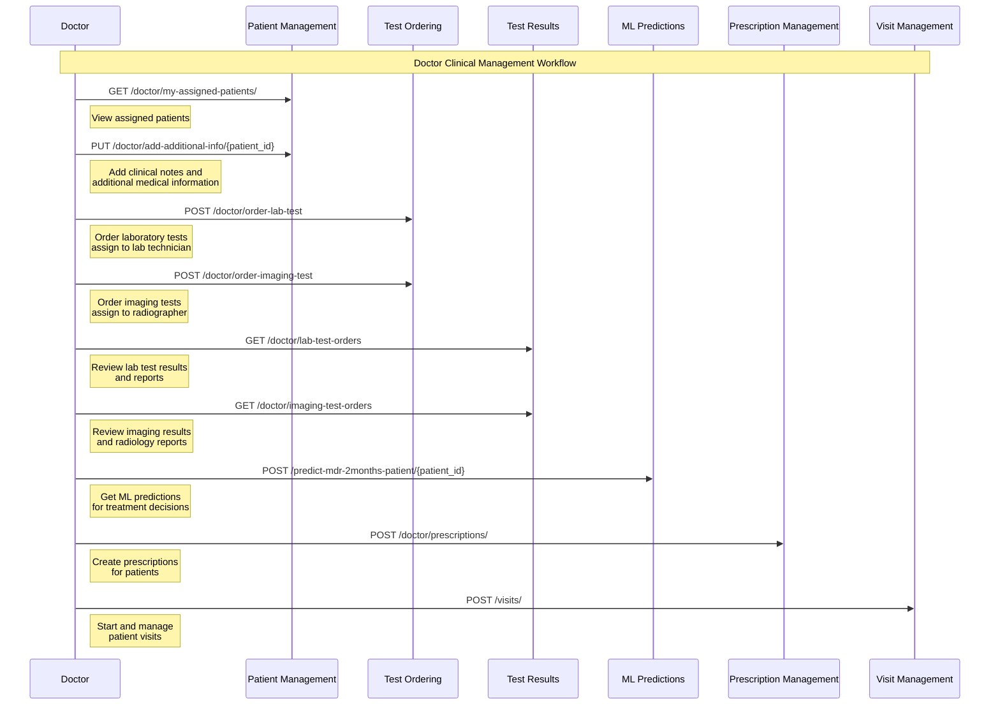
```mermaid
sequenceDiagram
    participant Doctor as Doctor
    participant Patients as Patient Management
    participant Tests as Test Ordering
    participant Results as Test Results
    participant ML as ML Predictions
    participant Prescriptions as Prescription Management
    participant Visits as Visit Management

    Note over Doctor,Visits: Doctor Clinical Management Workflow
    
    Doctor->>Patients: GET /doctor/my-assigned-patients/
    Note right of Doctor: View assigned patients
    
    Doctor->>Patients: PUT /doctor/add-additional-info/{patient_id}
    Note right of Doctor: Add clinical notes and<br/>additional medical information
    
    Doctor->>Tests: POST /doctor/order-lab-test
    Note right of Doctor: Order laboratory tests<br/>assign to lab technician
    
    Doctor->>Tests: POST /doctor/order-imaging-test
    Note right of Doctor: Order imaging tests<br/>assign to radiographer
    
    Doctor->>Results: GET /doctor/lab-test-orders
    Note right of Doctor: Review lab test results<br/>and reports
    
    Doctor->>Results: GET /doctor/imaging-test-orders
    Note right of Doctor: Review imaging results<br/>and radiology reports
    
    Doctor->>ML: POST /predict-mdr-2months-patient/{patient_id}
    Note right of Doctor: Get ML predictions<br/>for treatment decisions
    
    Doctor->>Prescriptions: POST /doctor/prescriptions/
    Note right of Doctor: Create prescriptions<br/>for patients
    
    Doctor->>Visits: POST /visits/
    Note right of Doctor: Start and manage<br/>patient visits
```

### 4. Nurse (`nurse`)

**Scope**: Patient registration, medical history collection, doctor assignment
**Primary Responsibilities**: Patient intake, medical history documentation, clinical support

#### Core Capabilities

| Capability | Endpoints | Description |
|------------|-----------|-------------|
| **Patient Search** | `GET /search-patients` | Search for existing patients by identifiers |
| **Patient Registration** | `POST /nurse/register-new-patient` | New patient registration and demographics |
| **Medical History** | `PUT /nurse/add-medical-history/{patient_id}` | Medical history collection and updates |
| **Doctor Assignment** | `PUT /assign-doctor/{patient_id}`, `DELETE /unassign-doctor/{patient_id}` | Patient-physician assignment management |
| **Patient Access** | `GET /nurse/my-added-patients/`, `GET /facility/patients` | Patient directory and facility oversight |
| **Dashboard** | `GET /nurse/stats/dashboard`, `GET /nurse/my-facility` | Nursing operations and statistics |

#### User Workflow: Nurse Patient Management

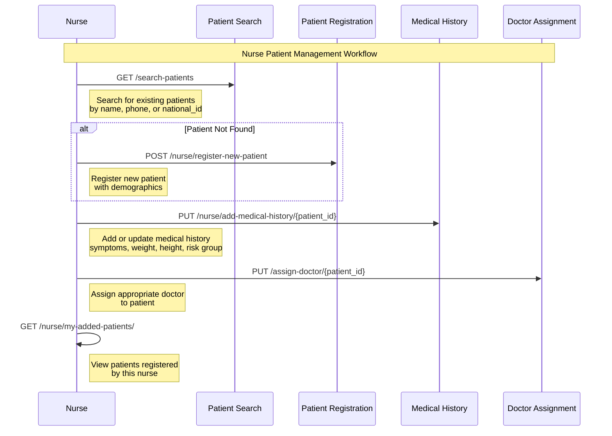
```mermaid
sequenceDiagram
    participant Nurse as Nurse
    participant Search as Patient Search
    participant Registration as Patient Registration
    participant History as Medical History
    participant Assignment as Doctor Assignment

    Note over Nurse,Assignment: Nurse Patient Management Workflow
    
    Nurse->>Search: GET /search-patients
    Note right of Nurse: Search for existing patients<br/>by name, phone, or national_id
    
    alt Patient Not Found
        Nurse->>Registration: POST /nurse/register-new-patient
        Note right of Nurse: Register new patient<br/>with demographics
    end
    
    Nurse->>History: PUT /nurse/add-medical-history/{patient_id}
    Note right of Nurse: Add or update medical history<br/>symptoms, weight, height, risk group
    
    Nurse->>Assignment: PUT /assign-doctor/{patient_id}
    Note right of Nurse: Assign appropriate doctor<br/>to patient
    
    Nurse->>Nurse: GET /nurse/my-added-patients/
    Note right of Nurse: View patients registered<br/>by this nurse
```

### 5. Lab Technician (`lab_technician`)

**Scope**: Laboratory test processing, specimen analysis
**Primary Responsibilities**: Sample collection, laboratory analysis, result reporting

#### Core Capabilities

| Capability | Endpoints | Description |
|------------|-----------|-------------|
| **Test Management** | `GET /lab/pending-tests`, `GET /lab/tests` | Laboratory test queue management |
| **Sample Processing** | `POST /lab/submit-test-results` | Specimen analysis and results entry |
| **Quality Control** | `PUT /lab/reports/{lab_test_report_id}` | Test result review and modification |
| **Workflow Tracking** | `GET /lab/reports/{lab_test_report_id}` | Laboratory workflow monitoring |

#### User Workflow: Lab Technician Testing Process

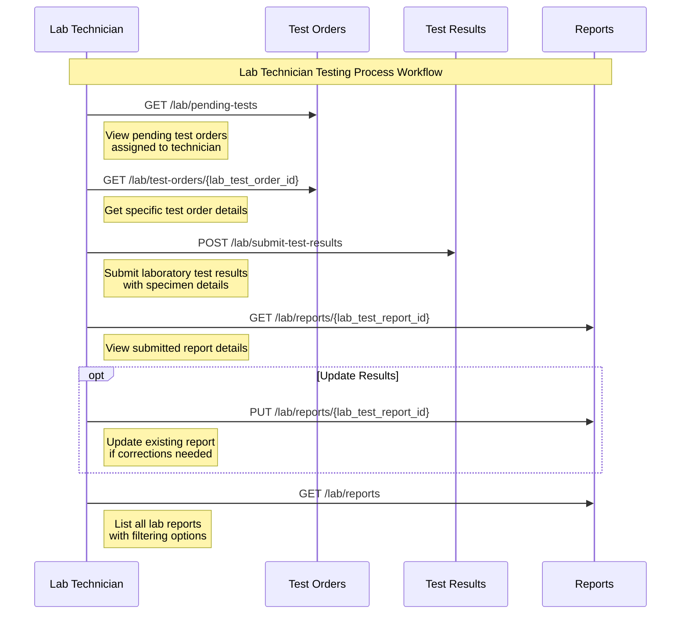
```mermaid
sequenceDiagram
    participant Tech as Lab Technician
    participant Orders as Test Orders
    participant Results as Test Results
    participant Reports as Reports

    Note over Tech,Reports: Lab Technician Testing Process Workflow
    
    Tech->>Orders: GET /lab/pending-tests
    Note right of Tech: View pending test orders<br/>assigned to technician
    
    Tech->>Orders: GET /lab/test-orders/{lab_test_order_id}
    Note right of Tech: Get specific test order details
    
    Tech->>Results: POST /lab/submit-test-results
    Note right of Tech: Submit laboratory test results<br/>with specimen details
    
    Tech->>Reports: GET /lab/reports/{lab_test_report_id}
    Note right of Tech: View submitted report details
    
    opt Update Results
        Tech->>Reports: PUT /lab/reports/{lab_test_report_id}
        Note right of Tech: Update existing report<br/>if corrections needed
    end
    
    Tech->>Reports: GET /lab/reports
    Note right of Tech: List all lab reports<br/>with filtering options
```

### 6. Radiographer (`radiographer`)

**Medical imaging acquisition, image upload, equipment operation**

#### Complete Endpoint List

##### Imaging Orders
- `GET /radiographer/imaging-test-orders` - Get imaging test orders (with status and patient filtering)
- `GET /radiographer/imaging-test-orders/{order_id}` - Get specific imaging test order details

##### Image Acquisition  
- `POST /radiographer/imaging-tests` - Create imaging test record (indicates test performed)
- `POST /radiographer/upload-image` - Upload patient image for imaging test
- `GET /radiographer/imaging-tests/{imaging_test_id}` - Get imaging test details

##### Work History
- `GET /radiographer/imaging-tests` - Get imaging tests performed by radiographer

##### Dashboard
- `GET /radiographer/stats` - Get radiographer dashboard statistics

#### User Workflow: Radiographer Imaging Process

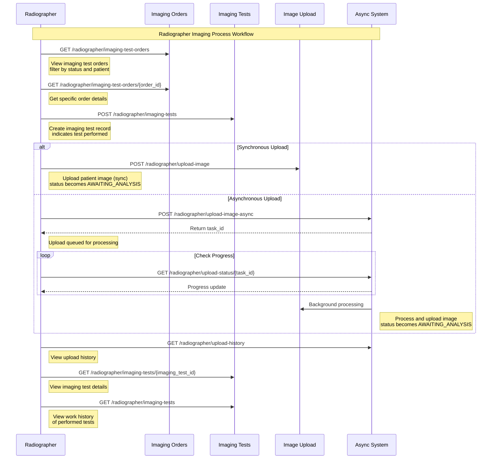
```mermaid
sequenceDiagram
    participant Radio as Radiographer
    participant Orders as Imaging Orders
    participant Tests as Imaging Tests
    participant Images as Image Upload
    participant AsyncSys as Async System

    Note over Radio,AsyncSys: Radiographer Imaging Process Workflow
    
    Radio->>Orders: GET /radiographer/imaging-test-orders
    Note right of Radio: View imaging test orders<br/>filter by status and patient
    
    Radio->>Orders: GET /radiographer/imaging-test-orders/{order_id}
    Note right of Radio: Get specific order details
    
    Radio->>Tests: POST /radiographer/imaging-tests
    Note right of Radio: Create imaging test record<br/>indicates test performed
    
    alt Synchronous Upload
        Radio->>Images: POST /radiographer/upload-image
        Note right of Radio: Upload patient image (sync)<br/>status becomes AWAITING_ANALYSIS
    else Asynchronous Upload
        Radio->>AsyncSys: POST /radiographer/upload-image-async
        AsyncSys-->>Radio: Return task_id
        Note right of Radio: Upload queued for processing
        
        loop Check Progress
            Radio->>AsyncSys: GET /radiographer/upload-status/{task_id}
            AsyncSys-->>Radio: Progress update
        end
        
        AsyncSys->>Images: Background processing
        Note right of AsyncSys: Process and upload image<br/>status becomes AWAITING_ANALYSIS
    end
    
    Radio->>AsyncSys: GET /radiographer/upload-history
    Note right of Radio: View upload history
    
    Radio->>Tests: GET /radiographer/imaging-tests/{imaging_test_id}
    Note right of Radio: View imaging test details
    
    Radio->>Tests: GET /radiographer/imaging-tests
    Note right of Radio: View work history<br/>of performed tests
```

### 7. Radiologist (`radiologist`)

**Medical image interpretation, diagnostic reporting**

#### Complete Endpoint List

##### Analysis Queue
- `GET /radiologist/pending-reports` - List imaging tests awaiting radiology reports
- `GET /radiologist/imaging-test/{imaging_test_id}/images` - Get images for analysis

##### Report Generation
- `POST /radiologist/submit-report` - Submit radiology report for imaging test
- `PUT /radiologist/reports/{report_id}` - Update existing radiology report
- `GET /radiologist/reports/{imaging_test_id}` - Get radiology report by imaging test ID
- `GET /radiologist/reports` - Get radiology reports created by radiologist

##### Dashboard
- `GET /radiologist/stats` - Get radiologist dashboard statistics

#### User Workflow: Radiologist Diagnostic Process

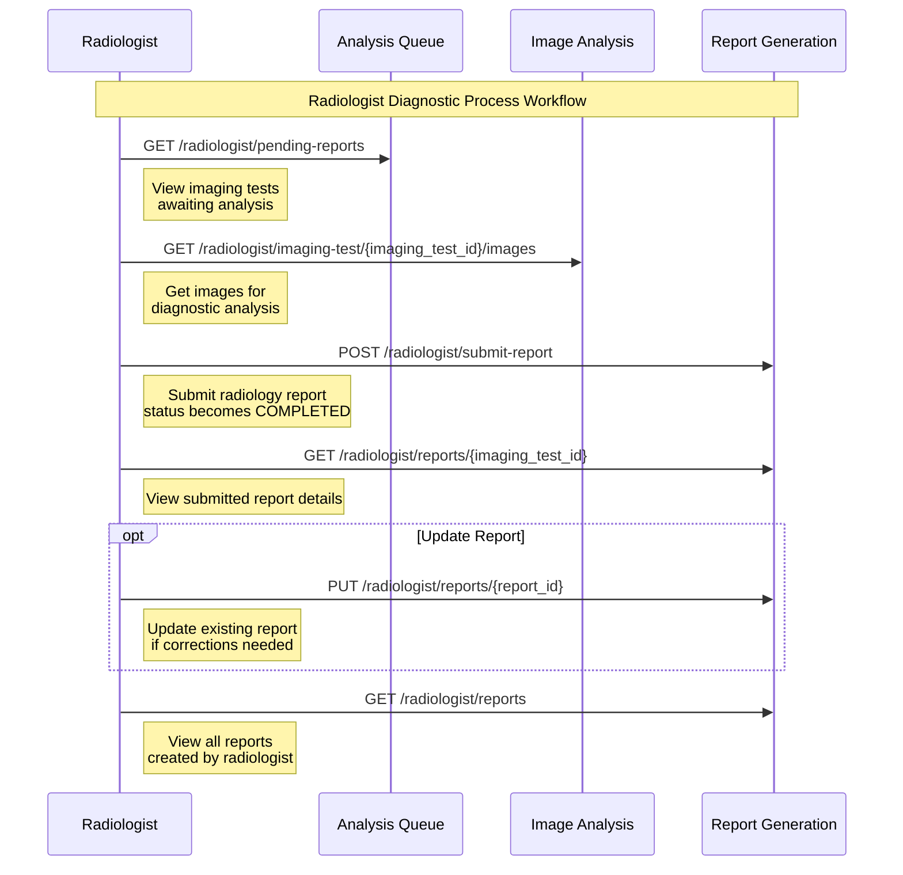
```mermaid
sequenceDiagram
    participant Radio as Radiologist
    participant Queue as Analysis Queue
    participant Images as Image Analysis
    participant Reports as Report Generation

    Note over Radio,Reports: Radiologist Diagnostic Process Workflow
    
    Radio->>Queue: GET /radiologist/pending-reports
    Note right of Radio: View imaging tests<br/>awaiting analysis
    
    Radio->>Images: GET /radiologist/imaging-test/{imaging_test_id}/images
    Note right of Radio: Get images for<br/>diagnostic analysis
    
    Radio->>Reports: POST /radiologist/submit-report
    Note right of Radio: Submit radiology report<br/>status becomes COMPLETED
    
    Radio->>Reports: GET /radiologist/reports/{imaging_test_id}
    Note right of Radio: View submitted report details
    
    opt Update Report
        Radio->>Reports: PUT /radiologist/reports/{report_id}
        Note right of Radio: Update existing report<br/>if corrections needed
    end
    
    Radio->>Reports: GET /radiologist/reports
    Note right of Radio: View all reports<br/>created by radiologist
```

---

## Clinical Workflows

The DSI-TB system implements integrated clinical workflows that support the complete tuberculosis care continuum. Each workflow is built around role-based access controls and real status tracking.

### 1. Laboratory Test Workflow

The laboratory workflow manages the complete lifecycle from test ordering through result reporting, with automated status transitions and role-based queue management.

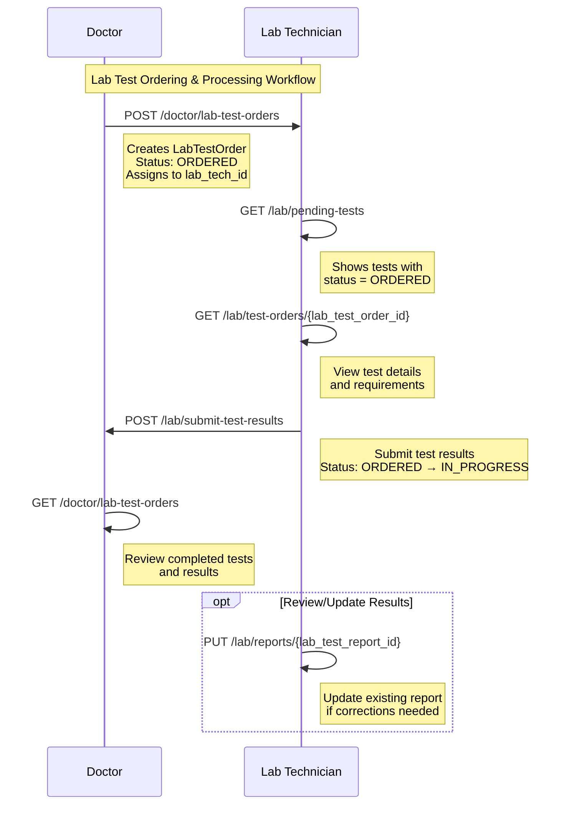
```mermaid
sequenceDiagram
    participant D as Doctor
    participant LT as Lab Technician

    Note over D,LT: Lab Test Ordering & Processing Workflow
    
    D->>LT: POST /doctor/lab-test-orders
    Note right of D: Creates LabTestOrder<br/>Status: ORDERED<br/>Assigns to lab_tech_id
    
    LT->>LT: GET /lab/pending-tests
    Note right of LT: Shows tests with<br/>status = ORDERED
    
    LT->>LT: GET /lab/test-orders/{lab_test_order_id}
    Note right of LT: View test details<br/>and requirements
    
    LT->>D: POST /lab/submit-test-results
    Note right of LT: Submit test results<br/>Status: ORDERED → IN_PROGRESS
    
    D->>D: GET /doctor/lab-test-orders
    Note right of D: Review completed tests<br/>and results
    
    opt Review/Update Results
        LT->>LT: PUT /lab/reports/{lab_test_report_id}
        Note right of LT: Update existing report<br/>if corrections needed
    end
```

#### Key Status Transitions
- **ORDERED**: Test created by doctor, appears in lab technician queue
- **IN_PROGRESS**: Lab technician has submitted initial results
- **COMPLETED**: Final results submitted and available to doctor

#### Supported Test Types
- **Sputum Conversion Test**: Monitors treatment response
- **Gene Xpert Test**: Rapid TB and resistance detection  
- **Other Lab Tests**: Custom tests with specified requirements

### 2. Medical Imaging Workflow

The imaging workflow coordinates test ordering, image acquisition, and radiological interpretation across three specialized roles.

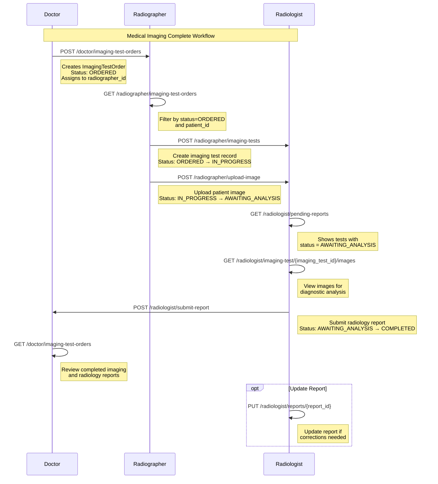
```mermaid
sequenceDiagram
    participant D as Doctor
    participant RG as Radiographer
    participant RL as Radiologist

    Note over D,RL: Medical Imaging Complete Workflow
    
    D->>RG: POST /doctor/imaging-test-orders
    Note right of D: Creates ImagingTestOrder<br/>Status: ORDERED<br/>Assigns to radiographer_id
    
    RG->>RG: GET /radiographer/imaging-test-orders
    Note right of RG: Filter by status=ORDERED<br/>and patient_id
    
    RG->>RL: POST /radiographer/imaging-tests
    Note right of RG: Create imaging test record<br/>Status: ORDERED → IN_PROGRESS
    
    RG->>RL: POST /radiographer/upload-image
    Note right of RG: Upload patient image<br/>Status: IN_PROGRESS → AWAITING_ANALYSIS
    
    RL->>RL: GET /radiologist/pending-reports
    Note right of RL: Shows tests with<br/>status = AWAITING_ANALYSIS
    
    RL->>RL: GET /radiologist/imaging-test/{imaging_test_id}/images
    Note right of RL: View images for<br/>diagnostic analysis
    
    RL->>D: POST /radiologist/submit-report
    Note right of RL: Submit radiology report<br/>Status: AWAITING_ANALYSIS → COMPLETED
    
    D->>D: GET /doctor/imaging-test-orders
    Note right of D: Review completed imaging<br/>and radiology reports
    
    opt Update Report
        RL->>RL: PUT /radiologist/reports/{report_id}
        Note right of RL: Update report if<br/>corrections needed
    end
```

#### Key Status Transitions
- **ORDERED**: Test created by doctor, appears in radiographer queue
- **IN_PROGRESS**: Radiographer has created test record
- **AWAITING_ANALYSIS**: Images uploaded, ready for radiologist review
- **COMPLETED**: Radiology report submitted and available to doctor

#### Supported Imaging Types
- **Chest X-ray**: Primary TB screening tool
- **CT Scan**: Detailed pulmonary assessment
- **Other**: Custom imaging as clinically indicated

### 3. ML Prediction Workflow

The ML prediction workflow provides AI-powered clinical decision support for sputum conversion prediction.

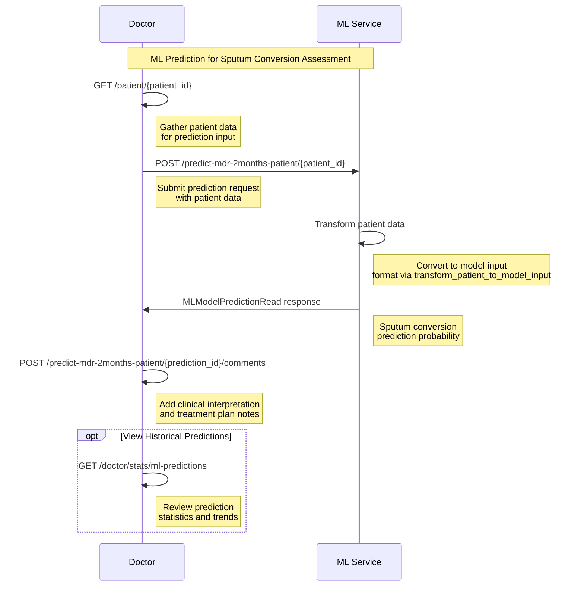
```mermaid
sequenceDiagram
    participant D as Doctor
    participant ML as ML Service

    Note over D,ML: ML Prediction for Sputum Conversion Assessment
    
    D->>D: GET /patient/{patient_id}
    Note right of D: Gather patient data<br/>for prediction input
    
    D->>ML: POST /predict-mdr-2months-patient/{patient_id}
    Note right of D: Submit prediction request<br/>with patient data
    
    ML->>ML: Transform patient data
    Note right of ML: Convert to model input<br/>format via transform_patient_to_model_input
    
    ML->>D: MLModelPredictionRead response
    Note right of ML: Sputum conversion<br/>prediction probability
    
    D->>D: POST /predict-mdr-2months-patient/{prediction_id}/comments
    Note right of D: Add clinical interpretation<br/>and treatment plan notes
    
    opt View Historical Predictions
        D->>D: GET /doctor/stats/ml-predictions
        Note right of D: Review prediction<br/>statistics and trends
    end
```

#### Prediction Features
- **Sputum Conversion Prediction**: Probability assessment for treatment response at 2 months
- **Clinical Integration**: Combines patient data (medical history, symptoms, demographics)
- **Doctor Comments**: Clinical interpretation and treatment planning notes
- **Historical Tracking**: Prediction statistics and trend analysis

### 4. Patient Visit Workflow

The visit workflow manages comprehensive patient encounters from registration through treatment planning.

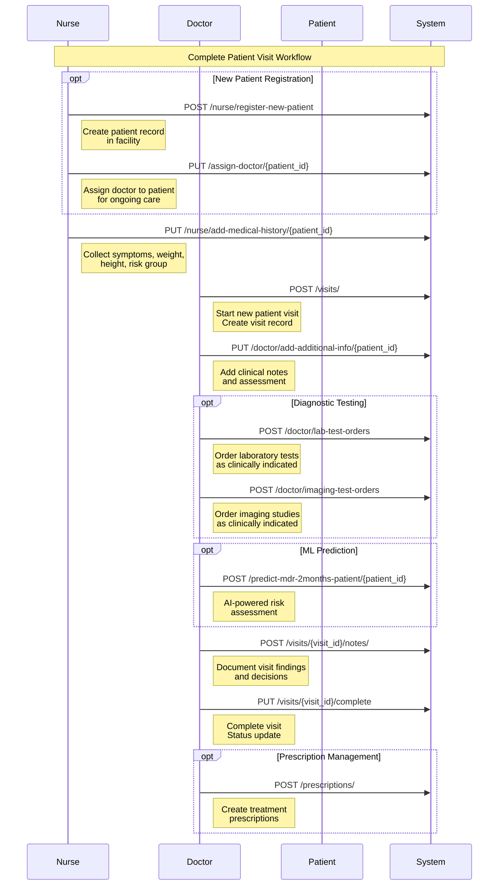
```mermaid
sequenceDiagram
    participant N as Nurse
    participant D as Doctor  
    participant P as Patient
    participant S as System

    Note over N,S: Complete Patient Visit Workflow
    
    opt New Patient Registration
        N->>S: POST /nurse/register-new-patient
        Note right of N: Create patient record<br/>in facility
        
        N->>S: PUT /assign-doctor/{patient_id}
        Note right of N: Assign doctor to patient<br/>for ongoing care
    end
    
    N->>S: PUT /nurse/add-medical-history/{patient_id}
    Note right of N: Collect symptoms, weight,<br/>height, risk group
    
    D->>S: POST /visits/
    Note right of D: Start new patient visit<br/>Create visit record
    
    D->>S: PUT /doctor/add-additional-info/{patient_id}
    Note right of D: Add clinical notes<br/>and assessment
    
    opt Diagnostic Testing
        D->>S: POST /doctor/lab-test-orders
        Note right of D: Order laboratory tests<br/>as clinically indicated
        
        D->>S: POST /doctor/imaging-test-orders  
        Note right of D: Order imaging studies<br/>as clinically indicated
    end
    
    opt ML Prediction
        D->>S: POST /predict-mdr-2months-patient/{patient_id}
        Note right of D: AI-powered risk<br/>assessment
    end
    
    D->>S: POST /visits/{visit_id}/notes/
    Note right of D: Document visit findings<br/>and decisions
    
    D->>S: PUT /visits/{visit_id}/complete
    Note right of D: Complete visit<br/>Status update
    
    opt Prescription Management
        D->>S: POST /prescriptions/
        Note right of D: Create treatment<br/>prescriptions
    end
```

#### Visit Management Features
- **Visit Tracking**: Complete visit lifecycle management
- **Clinical Documentation**: Visit notes and clinical decision documentation
- **Integrated Workflows**: Seamless connection to lab, imaging, and ML prediction workflows
---

## Error Handling

The DSI-TB API implements comprehensive error handling with standardized error responses, detailed error codes, and actionable guidance for client applications.

### Error Response Structure

All API errors follow a consistent JSON structure that provides comprehensive debugging information:

```json
{
  "error": {
    "code": "VALIDATION_ERROR",
    "message": "Request validation failed",
    "details": [
      {
        "field": "email",
        "error": "Invalid email format",
        "value": "invalid-email",
        "constraint": "Must be a valid email address"
      }
    ],
    "timestamp": "2024-01-20T10:30:00Z",
    "request_id": "req_123456789",
    "documentation_url": "https://docs.dsi-tb.com/errors/validation",
    "suggestion": "Please verify the email format and try again"
  }
}
```

### HTTP Status Codes & Meanings

#### 2xx Success Codes

| Code | Status | Description | Usage |
|------|--------|-------------|-------|
| `200` | OK | Successful GET, PUT requests |
| `201` | Created | Successful POST requests |
| `204` | No Content | Successful DELETE requests |
| `400` | Bad Request | Invalid request data |
| `401` | Unauthorized | Missing or invalid authentication |
| `403` | Forbidden | Insufficient permissions |
| `404` | Not Found | Resource does not exist |
| `409` | Conflict | Resource already exists |
| `422` | Unprocessable Entity | Validation errors |
| `429` | Too Many Requests | Rate limit exceeded |
| `500` | Internal Server Error | Server-side error |

---

## Integration Components

### Machine Learning Model Integration

The DSI-TB system integrates sophisticated ML models for tuberculosis prediction and diagnosis assistance. The ML integration provides automated risk assessment and clinical decision support.

#### ML Model Architecture

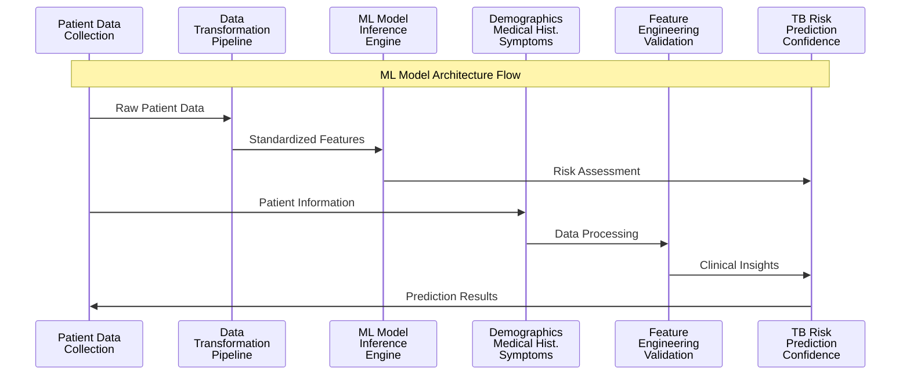
```mermaid
sequenceDiagram
    participant Collection as Patient Data<br/>Collection
    participant Transform as Data<br/>Transformation<br/>Pipeline
    participant ML as ML Model<br/>Inference<br/>Engine
    participant Demo as Demographics<br/>Medical Hist.<br/>Symptoms
    participant Feature as Feature<br/>Engineering<br/>Validation
    participant Prediction as TB Risk<br/>Prediction<br/>Confidence

    Note over Collection,Prediction: ML Model Architecture Flow
    
    Collection->>Transform: Raw Patient Data
    Transform->>ML: Standardized Features
    ML->>Prediction: Risk Assessment
    Collection->>Demo: Patient Information
    Demo->>Feature: Data Processing
    Feature->>Prediction: Clinical Insights
    Prediction->>Collection: Prediction Results
```

#### Data Transformation Pipeline

The ML model requires patient data to be transformed into a standardized format:

| Input Data Source | Transformation Logic | Output Feature |
|-------------------|---------------------|----------------|
| **Demographics** | `patient.gender.lower()` | `SEX: "M" or "F"` |
| **Age** | `patient.age` | `AGE_YEARS: integer` |
| **Anthropometric** | `weight / (height_m)²` | `BMI: float` |
| **HIV Status** | `medical.hiv_status.lower()` | `HIV_STATUS: "POSITIVE/NEGATIVE"` |
| **Medical History** | Boolean flags → Yes/No strings | Various boolean features |
| **Symptoms** | Boolean symptom presence | Clinical feature flags |
| **Social History** | Risk factor assessment | Lifestyle indicators |

#### ML Model Endpoint Integration

**Feature Engineering Function:**
```python
def transform_patient_to_model_input(patient_id: str, db: Session) -> dict:
    """
    Transforms patient data into ML model input format.
    
    Args:
        patient_id: UUID of the patient
        db: Database session
        
    Returns:
        dict: Standardized feature dictionary for ML model
        
    Raises:
        HTTPException: If patient data is incomplete or invalid
    """
    # Comprehensive data validation and transformation
    # BMI calculation with safety checks
    # Boolean to string conversions
    # Missing data handling
```

**Model Inference Service:**
```python
def send_image_for_inference(image_bytes: bytes, filename: str) -> dict:
    """
    Sends medical images to external ML inference API.
    
    Args:
        image_bytes: Raw image data
        filename: Original filename for context
        
    Returns:
        dict: ML model prediction results
        
    Features:
        - Multipart form data handling
        - Error handling and retries
        - Response validation
        - Timeout management
    """
```

#### ML Model Data Requirements

| Feature Category | Required Fields | Data Quality Requirements |
|------------------|----------------|--------------------------|
| **Patient Demographics** | Age, Gender, BMI | Age: 0-120, BMI: 10-60 |
| **Medical History** | HIV status, Previous TB, Diabetes | Boolean or categorical |
| **Clinical Symptoms** | 7 core TB symptoms | Boolean presence flags |
| **Social Factors** | Education, Housing, Lifestyle | Standardized categories |
| **Vital Signs** | Temperature | Celsius, range 30-45°C |

#### Model Performance Monitoring

**Prediction Tracking:**
```python
class MLModelPrediction(SQLModel, table=True):
    id: str = Field(default_factory=lambda: str(uuid4()), primary_key=True)
    patient_id: str = Field(foreign_key="patientdemographic.id")
    prediction: str  # MTBC_POSITIVE/MTBC_NEGATIVE
    probability_mtbc_positive: float
    probability_mtbc_negative: float
    confidence: str  # HIGH/MEDIUM/LOW
    model_version: str = "1.0"
    inference_time_ms: int
    created_at: datetime
```
**Quality Metrics:**
- **Prediction Confidence Distribution**
- **Model Response Time** (target: <200ms)
- **Error Rate Monitoring** (target: <1%)
- **Data Quality Scores** (completeness, validity)

### DICOM and Medical Imaging Integration

The system integrates with Orthanc PACS (Picture Archiving and Communication System) for medical imaging management and provides fallback to local filesystem storage.

#### Medical Image Upload Architecture

The system supports both synchronous and asynchronous image upload workflows with Redis-based task management for background processing.

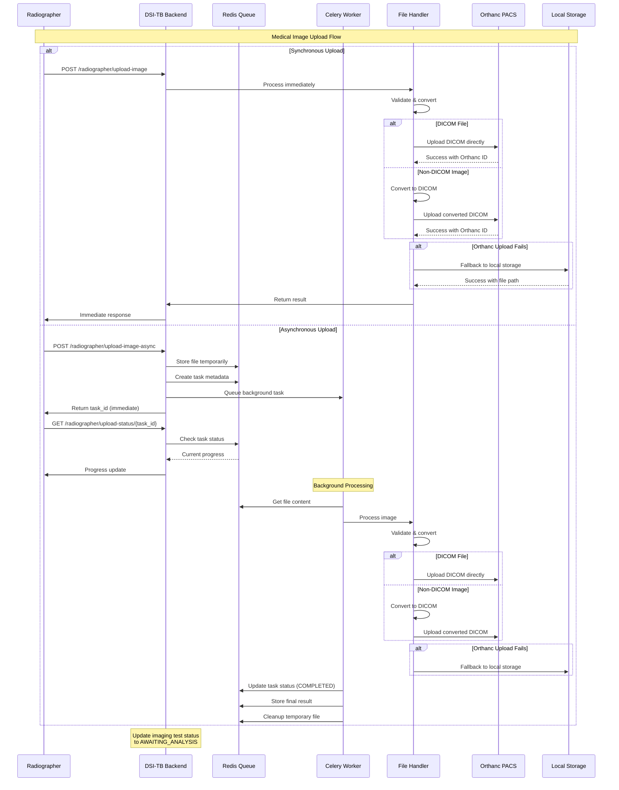
```mermaid
sequenceDiagram
    participant User as Radiographer
    participant Backend as DSI-TB Backend
    participant Redis as Redis Queue
    participant Worker as Celery Worker
    participant FileHandler as File Handler
    participant Orthanc as Orthanc PACS
    participant Filesystem as Local Storage

    Note over User,Filesystem: Medical Image Upload Flow
    
    alt Synchronous Upload
        User->>Backend: POST /radiographer/upload-image
        Backend->>FileHandler: Process immediately
        FileHandler->>FileHandler: Validate & convert
        
        alt DICOM File
            FileHandler->>Orthanc: Upload DICOM directly
            Orthanc-->>FileHandler: Success with Orthanc ID
        else Non-DICOM Image
            FileHandler->>FileHandler: Convert to DICOM
            FileHandler->>Orthanc: Upload converted DICOM
            Orthanc-->>FileHandler: Success with Orthanc ID
        end
        
        alt Orthanc Upload Fails
            FileHandler->>Filesystem: Fallback to local storage
            Filesystem-->>FileHandler: Success with file path
        end
        
        FileHandler->>Backend: Return result
        Backend->>User: Immediate response
        
    else Asynchronous Upload
        User->>Backend: POST /radiographer/upload-image-async
        Backend->>Redis: Store file temporarily
        Backend->>Redis: Create task metadata
        Backend->>Worker: Queue background task
        Backend->>User: Return task_id (immediate)
        
        User->>Backend: GET /radiographer/upload-status/{task_id}
        Backend->>Redis: Check task status
        Redis-->>Backend: Current progress
        Backend->>User: Progress update
        
        Note over Worker: Background Processing
        Worker->>Redis: Get file content
        Worker->>FileHandler: Process image
        FileHandler->>FileHandler: Validate & convert
        
        alt DICOM File
            FileHandler->>Orthanc: Upload DICOM directly
        else Non-DICOM Image
            FileHandler->>FileHandler: Convert to DICOM
            FileHandler->>Orthanc: Upload converted DICOM
        end
        
        alt Orthanc Upload Fails
            FileHandler->>Filesystem: Fallback to local storage
        end
        
        Worker->>Redis: Update task status (COMPLETED)
        Worker->>Redis: Store final result
        Worker->>Redis: Cleanup temporary file
    end
    
    Note over Backend: Update imaging test status<br/>to AWAITING_ANALYSIS
```

#### Async Upload System

**Architecture Components:**
- **Redis Queue**: Message broker and temporary file storage
- **Celery Workers**: Background task processors (4 concurrent tasks)
- **Task Management**: Redis-based state tracking with TTL cleanup

**Upload Modes:**
| Mode | Use Case | Response Time | Progress Tracking |
|------|----------|---------------|-------------------|
| **Synchronous** | Small files (<5MB), immediate results needed | 30s-2min | Real-time |
| **Asynchronous** | Large files (>5MB), background processing | Immediate | Polling-based |

**Async Upload Workflow:**
1. **Queue**: File stored temporarily in Redis, task created
2. **Processing**: Background worker processes identical to sync logic  
3. **Progress**: Real-time status updates via task polling
4. **Completion**: Final result stored, temporary data cleaned up

**Task States:**
- `PENDING`: Queued, waiting to start
- `PROCESSING`: Currently being processed (with progress %)
- `COMPLETED`: Successfully processed (includes result data)
- `FAILED`: Processing failed (includes error details)

**Endpoints:**
- `POST /radiographer/upload-image-async` - Queue async upload
- `GET /radiographer/upload-status/{task_id}` - Check progress
- `GET /radiographer/upload-history` - View upload history
- `GET /radiographer/system-status` - System health check

**Redis Data Management:**
- Temporary files: 1-hour TTL
- Task results: 24-hour TTL  
- Automatic cleanup prevents memory leaks
- User upload history with sorting

**Scalability:**
- Multiple Celery workers for concurrent processing
- Horizontal scaling support
- Queue-based load distribution

#### Image Processing Features

**File Validation:**
- Maximum file size: 20MB
- Supported MIME types: image/jpeg, image/png, image/dicom, application/dicom
- File extension validation: .jpg, .jpeg, .png, .dcm, .DCM

**DICOM Conversion:**
- Automatic PNG/JPEG to DICOM conversion for non-DICOM uploads
- Metadata preservation during conversion
- Patient ID integration with DICOM headers

**Storage Redundancy:**
- Primary: Orthanc PACS server storage
- Fallback: Local filesystem storage
- Configurable timeout and retry mechanisms

**Access Control:**
- Role-based image access
- Audit trail logging
- Secure transmission (HTTPS/TLS)
- Data retention policies

### Security and Logging

The system implements security logging for critical events and uses standard application logging for monitoring.

#### Security Logging Implementation

The system includes a dedicated security logger for sensitive operations:

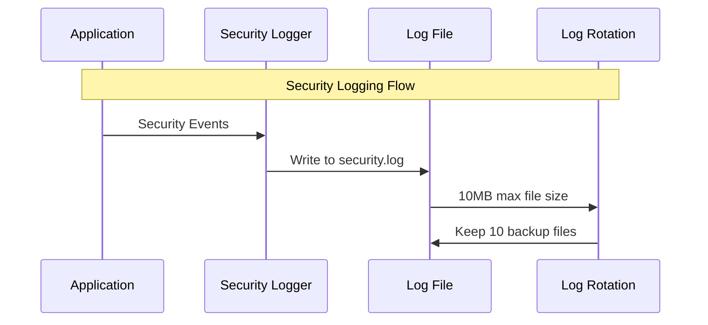
```mermaid
sequenceDiagram
    participant App as Application
    participant Logger as Security Logger
    participant File as Log File
    participant Rotation as Log Rotation

    Note over App,Rotation: Security Logging Flow
    
    App->>Logger: Security Events
    Logger->>File: Write to security.log
    File->>Rotation: 10MB max file size
    Rotation->>File: Keep 10 backup files
```

#### Currently Logged Security Events

| Event Type | Details | Log Format |
|------------|---------|------------|
| **Password Reset Requests** | Email (masked), IP address, user agent, success status | INFO level with timestamp |

#### Log Configuration

**File Management:**
- Log file: `logs/security.log`
- Maximum file size: 10MB
- Backup files: 10 rotated files
- Format: Timestamp - Level - Message

**Security Features:**
- Email masking for privacy protection
- IP address logging for security monitoring
- Separate log file for security events
- No propagation to root logger

#### Application Logging

Standard application logging is configured in `logging_config.py` with:
- Console and file handlers
- Structured log formatting
- Configurable log levels
- Error tracking and monitoring
1. **Authentication Events**
   ```python
   log_password_reset_request(
       email="masked_email",
       ip_address="client_ip",
       user_agent="browser_info",
       success=True
   )
   ```

2. **Data Access Events**
   ```python
   log_patient_access(
       user_id="doctor_id",
       patient_id="masked_patient_id",
       access_type="read/write/delete",
       timestamp=datetime.utcnow()
   )
   ```

3. **Administrative Events**
   ```python
   log_role_assignment(
       admin_id="admin_user_id",
       target_user="target_user_id",
       role_assigned="doctor",
       facility_id="facility_id"
   )
   ```

#### Log Management and Monitoring

**Rotation and Retention:**
```python
security_handler = RotatingFileHandler(
    "logs/security.log",
    maxBytes=10*1024*1024,  # 10MB per file
    backupCount=10,         # Keep 10 backup files
    encoding='utf-8'
)
```

**Log Monitoring Alerts:**
- **Failed Login Attempts** (>5 in 15 minutes)
- **Privilege Escalation** (role changes)
- **Bulk Data Access** (>100 records in 1 hour)
- **Off-hours Access** (outside business hours)
- **Geographic Anomalies** (unusual IP locations)

#### Compliance and Audit Support

**HIPAA Compliance Features:**
- **Access Logs**: Complete audit trail of PHI access
- **User Authentication**: Strong authentication logging
- **Data Modification**: Change tracking with user attribution
- **System Access**: Administrative action logging

**Audit Report Generation:**
```python
def generate_audit_report(
    start_date: date,
    end_date: date,
    event_types: List[str] = None,
    user_id: str = None
) -> AuditReport:
    """
    Generate compliance audit reports.
    
    Features:
    - Date range filtering
    - Event type filtering
    - User-specific reports
    - Exportable formats (PDF, CSV, JSON)
    """
```

### External Service Integration

#### Email Notification Service

**SMTP Configuration:**
```python
# Production-grade email configuration
MAIL_SETTINGS = {
    "MAIL_HOST": "smtp.gmail.com",
    "MAIL_PORT": 587,
    "MAIL_TLS": True,
    "MAIL_SSL": False,
    "MAIL_USERNAME": "notifications@yourdomain.com",
    "MAIL_PASSWORD": "app_specific_password"
}
```

**Notification Types:**
- **Account Management**: Password resets, account verification
- **Clinical Alerts**: Urgent test results, appointment reminders
- **System Notifications**: Maintenance windows, security alerts
- **Compliance Reports**: Audit summaries, backup confirmations

#### Rate Limiting and API Protection

**Rate Limiting Configuration:**
```python
from auth.rate_limiter import rate_limiter

@app.middleware("http")
async def rate_limiting_middleware(request: Request, call_next):
    """
    Global rate limiting middleware.
    
    Limits:
    - Authentication endpoints: 5 requests/minute
    - Data access endpoints: 100 requests/minute
    - Administrative endpoints: 10 requests/minute
    """
```

**DDoS Protection:**
- IP-based rate limiting
- Geo-blocking capabilities
- Request pattern analysis
- Automatic blacklisting

---
